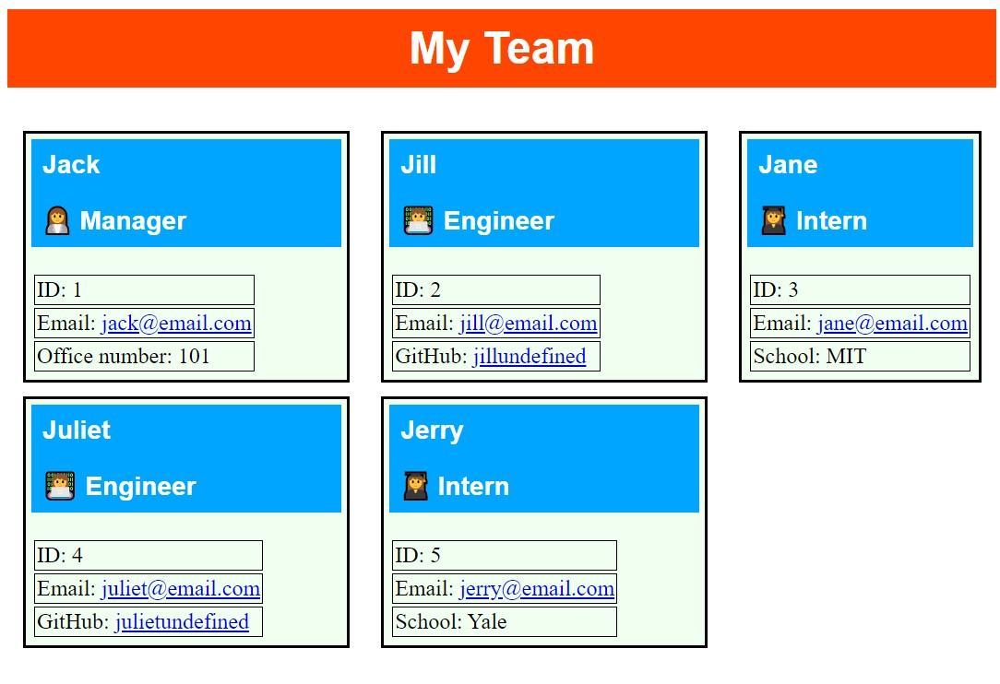

# HW10-OOP-TeamProfileGenerator

  

  # Description
  
  This is a repository that contains code for generating a Team Profile. The JavaScript code uses classes to generate employees: manager, engineer, intern. You run the code in Node.js where you are given a series of questions to add team members, an html file is generated in the dist folder, when used with the CSS file provided in the dist folder you can then view your team profile in browser.

  # Table of Contents
  
  - [Installation](#installation)
  - [Usage](#usage)
  
  
  - [Tests](#tests)
  - [Questions](#questions)

  # Installation
  
  Node.js and installation of the inquirer package using NPM.

  # Usage
  
  
  
  

  # Tests
  
  There is a test folder containing four test files for the classes of the employee roles.

  # Questions
  
  You can find my GitHub profile at: https://github.com/r134x7

  If you have any questions, you can contact me by email: r134x7@gmx.com

